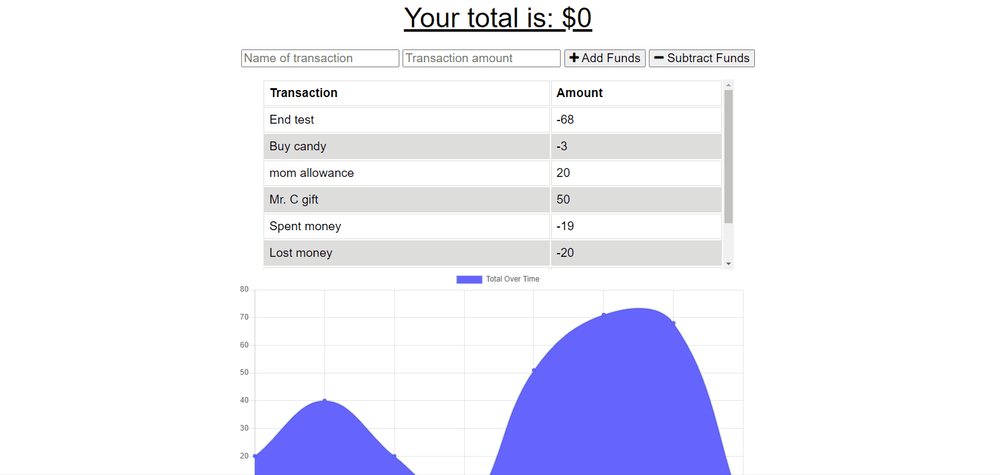

# MoneyDo 💸

A budget tracker in the form of a Progressive Web Application that handles users' financial information both on and offline.

## 📚 Table of Contents

- [MoneyDo 💸](#moneydo-)
  - [📚 Table of Contents](#-table-of-contents)
  - [🧾 Features](#-features)
  - [🛠️ Installation](#️-installation)
  - [👨‍🏫 Usage](#-usage)
  - [🥂 Credits](#-credits)
  - [👋 How to Contribute](#-how-to-contribute)

## 🧾 Features

- Offline functionality
- Can be downloaded to desktop or homescreen on mobile
- Add expenses and deposits to budget
- Database updates when network regains connection
- Perfect for extended time off-network or for users with low-bandwidth
- Track withdrawals while travelling
- Trust in a consistently accurate account balance
- Notification alerts user when actions are completed
- Utilizes service workers and webmanifest
- Database by MongoDB

## 🛠️ Installation

Locate the dropdown menu labeled 'Code' to the left of the About section in the main page of this repository. From there, select your preferred cloning method from HTTPS, SSH, or the GitHub CLI. For this demonstration, we will be using the SSH method. Copy the link and head to your terminal. From the command line you should enter:

    git clone <INSERT_SSH_KEY_HERE>

Replacing the above placeholder with the link copied from GitHub. This will clone the repository into a local directory on your machine. And that's it! Happy Hacking! 🚀

## 👨‍🏫 Usage

## 🥂 Credits

UT Austin Coding Boot Camp https://techbootcamps.utexas.edu/coding/

Kyle Ferguson https://github.com/kferguson52

Stack Overflow https://stackoverflow.com/

## 👋 How to Contribute

See the [Contributor Covenant](https://www.contributor-covenant.org/) for details on how to contribute